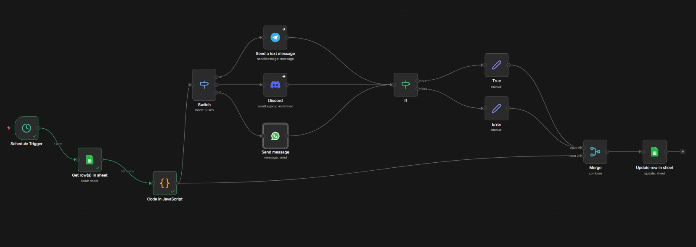

# Multi-Platform Social Media Scheduler

A comprehensive workflow automation system that schedules and sends messages across multiple platforms including Telegram, Discord, and WhatsApp. This project demonstrates seamless integration between Google Sheets scheduling and multiple messaging platforms with intelligent routing and error handling.

## 🌟 Features

- **Multi-Platform Support**: Send scheduled messages to Telegram, Discord, and WhatsApp from a single workflow
- **Google Sheets Integration**: Manage all scheduled posts from a centralized spreadsheet
- **Intelligent Routing**: Automatically routes messages to the correct platform based on configuration
- **Real-time Status Tracking**: Updates Google Sheets with delivery status, timestamps, and error messages
- **Conditional Logic**: Smart branching based on platform and execution status
- **Error Handling**: Comprehensive error tracking with automatic status updates
- **Scheduled Execution**: Built-in scheduler triggers workflow at specified intervals

## 🏗️ Architecture

The workflow consists of several integrated components:



### Workflow Flow:

1. **Schedule Trigger**: Initiates the workflow at specified times
2. **Get Rows from Sheet**: Fetches scheduled posts from Google Sheets
3. **Code in JavaScript**: Processes and validates data
4. **Switch Node**: Routes based on platform type (Telegram/Discord/WhatsApp)
5. **Platform Nodes**: Sends messages to respective platforms
6. **Conditional Logic (IF)**: Handles success/error branching
7. **Merge**: Consolidates results from different execution paths
8. **Update Row in Sheet**: Updates Google Sheets with execution status

## 📋 Prerequisites

Before you begin, ensure you have:

- Google Sheets account with API access
- **Telegram Bot** (optional): Bot token from [@BotFather](https://t.me/botfather)
- **Discord Webhook** (optional): Webhook URL from Discord server settings
- **WhatsApp Business Account** (optional): Meta Business Suite access with WhatsApp API credentials
- Workflow automation platform (n8n, Make, Zapier, etc.)

## 🚀 Setup Instructions

### 1. Google Sheets Setup

Create a Google Sheet with the following columns:


### 2. Platform-Specific Setup

#### Telegram Setup

1. Create a bot via [@BotFather](https://t.me/botfather)
2. Get your bot token (format: `123456789:ABCdefGHIjklMNOpqrsTUVwxyz`)
3. Get your chat ID:
   - Send a message to your bot
   - Visit: `https://api.telegram.org/bot<YOUR_BOT_TOKEN>/getUpdates`
   - Find your chat ID in the response

#### Discord Setup

1. Open your Discord server
2. Go to Server Settings → Integrations → Webhooks
3. Create a new webhook
4. Copy the webhook URL (format: `https://discord.com/api/webhooks/...`)

#### WhatsApp Setup

1. Create a Meta Business Account at [business.facebook.com](https://business.facebook.com)
2. Set up WhatsApp Business API:
   - Go to [Meta for Developers](https://developers.facebook.com/)
   - Create or select an app
   - Add WhatsApp product
   - Configure phone number and webhook

3. Get your credentials:
   - Phone Number ID
   - WhatsApp Business Account ID
   - Access Token

4. **For Development**: Add recipient numbers to allowed list in Meta Business Suite

### 3. Workflow Configuration

1. **Import the workflow** into your automation platform
2. **Configure credentials** for each platform:
   - Google Sheets: OAuth2 or Service Account
   - Telegram: Bot token
   - Discord: Webhook URL
   - WhatsApp: Phone Number ID and Access Token

3. **Set up the schedule trigger**:
   - Recommended: Every 5-15 minutes
   - Adjust based on your posting frequency

4. **Configure the JavaScript node** (if needed):
   - Data validation logic
   - Date/time parsing
   - Custom transformations

## 📊 Data Structure

### Google Sheets Row Format

```json
{
  "row_number": 29,
  "post_id": 28,
  "scheduled_date": "2026-01-22",
  "scheduled_time": "15:25",
  "content": "Your message content here",
  "platform": "telegram",
  "status": "scheduled",
  "posted_at": "",
  "error_message": "",
  "media_url": "",
  "platform_message_id": ""
}
```

### Platform Values

- `telegram` - For Telegram messages
- `discord` - For Discord messages
- `whatsapp` - For WhatsApp messages

### Status Values

- `scheduled` - Pending execution
- `posted` - Successfully delivered
- `error` - Failed delivery (check error_message)

## 🔧 Usage

### Scheduling a Message

1. Open your Google Sheet
2. Add a new row with:
   - Target platform (telegram/discord/whatsapp)
   - Scheduled date and time
   - Message content
   - Status: "scheduled"
3. The workflow will automatically process and send at the specified time
4. Check the sheet for updated status and timestamp

### Message Content

- **Plain text**: Simply enter your message
- **With media**: Add media URL in the `media_url` column (platform support varies)
- **Formatting**: Use platform-specific markdown (varies by platform)

### Phone Number Format (WhatsApp Only)

**Critical**: Use international format without + sign:

- ✅ Correct: `147583928534` (US)
- ✅ Correct: `14155551234` (US)

## 🛡️ Error Handling

The workflow includes comprehensive error handling:

### Common Errors

**Telegram:**

- Invalid token: Verify bot token
- Chat not found: Ensure chat ID is correct
- Message too long: Telegram has 4096 character limit

**Discord:**

- Invalid webhook: Check webhook URL
- Rate limiting: Add delays between messages
- Character limit: Discord allows 2000 characters

**WhatsApp:**

- Recipient not allowed: Add number to Meta Business Suite (dev mode)
- Invalid phone format: Use country code + number (no symbols)
- Authentication failed: Verify access token

### Error Recovery

- Errors are logged in the `error_message` column
- Status automatically updates to "error"
- Failed messages can be retried by changing status back to "scheduled"

## 🎯 Best Practices

1. **Scheduling**:
   - Schedule at least 2-3 minutes in the future
   - Account for workflow execution time
   - Test with a single message first

2. **Performance**:
   - Limit batch size (recommend: 10-20 messages per run)
   - Add delays between platform API calls to avoid rate limits
   - Use filters to process only "scheduled" status rows

3. **Content**:
   - Keep messages under platform limits
   - Test formatting on each platform
   - Validate URLs before scheduling

4. **Monitoring**:
   - Regularly check error_message column
   - Monitor platform API quotas
   - Set up alerts for repeated failures

## 📈 Moving to Production

### WhatsApp Production Mode

1. Complete Meta's Business Verification
2. Submit app for App Review
3. Request `whatsapp_business_messaging` permission
4. Once approved, remove recipient restrictions

### Scale Considerations

- Implement rate limiting between messages
- Consider platform API quotas and costs
- Add retry logic for transient failures
- Set up monitoring and alerting
- Backup your Google Sheets regularly

## 🔐 Security Best Practices

- **Never commit credentials** to version control
- Use environment variables or secure credential storage
- **Rotate tokens/keys** regularly (every 90 days)
- Implement proper authentication for workflow triggers
- **Audit access** to Google Sheets regularly
- Monitor API usage for unusual activity
- Use separate credentials for development/production

## 🐛 Troubleshooting

### Workflow Not Triggering

- Check schedule trigger configuration
- Verify workflow is activated
- Review execution history for errors

### Messages Not Sending

- Verify platform credentials are valid
- Check row status is "scheduled"
- Ensure scheduled time has passed
- Review error_message column for details

### Google Sheets Not Updating

- Verify Google Sheets permissions
- Check sheet name and range configuration
- Ensure row_number column is unique

### Platform-Specific Issues

- **Telegram**: Bot must be started by user before sending
- **Discord**: Webhook must have proper permissions
- **WhatsApp**: Number format and allowed list (dev mode)

## 📚 Additional Resources

- [n8n Documentation](https://docs.n8n.io/)
- [Telegram Bot API](https://core.telegram.org/bots/api)
- [Discord Webhooks Guide](https://discord.com/developers/docs/resources/webhook)
- [WhatsApp Business Platform](https://developers.facebook.com/docs/whatsapp)
- [Google Sheets API](https://developers.google.com/sheets/api)

## 🚀 Future Enhancements

Potential improvements for this workflow:

- [ ] Add support for more platforms (Slack, Twitter, LinkedIn)
- [ ] Image and video attachment support
- [ ] Timezone handling for global scheduling
- [ ] Recurring message scheduling
- [ ] Analytics dashboard
- [ ] Bulk import/export functionality
- [ ] Template management system
- [ ] A/B testing capabilities

## 📄 License

MIT License - feel free to use this workflow for your projects

## 🤝 Contributing

Contributions, issues, and feature requests are welcome!

**To contribute:**

1. Fork the repository
2. Create a feature branch (`git checkout -b feature/amazing-feature`)
3. Commit your changes (`git commit -m 'Add amazing feature'`)
4. Push to the branch (`git push origin feature/amazing-feature`)
5. Open a Pull Request

## 👤 Author

**[Ubba Obada]**

- LinkedIn: [www.linkedin.com/in/obada-barakat]
- GitHub: [@Obada-barakat](https://github.com/Obada-barakat)
- Portfolio: [https://ubba-portfolio.vercel.app/]

## ⭐ Show Your Support

Give a ⭐️ if this project helped you automate your social media posting!

## 🙏 Acknowledgments

- Thanks to the n8n community for inspiration
- All the platform API documentation teams
- Open source contributors

---

**Note**: This workflow is designed for demonstration and educational purposes. Ensure compliance with each platform's Terms of Service, API usage policies, and applicable regulations when deploying to production.
